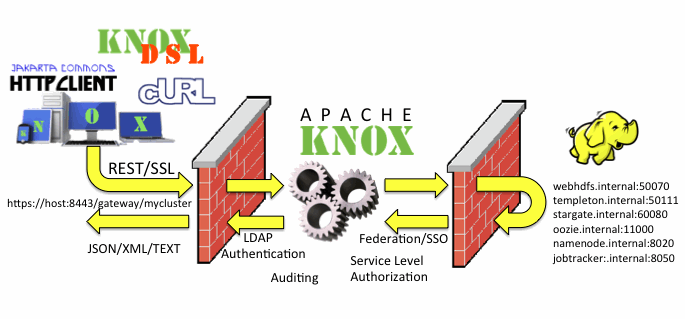

# KNOX 使用指南

## KNOX简介
KNOX是一个用来访问Hadoop的网关服务，它提供了一个单点服务，你可以通过Knox访问所有他代理的Hadoop服务。Knox通过代理各个服务，不仅构造了同意的服务入口，屏蔽了集群具体实现，同时还简化了安全实施下使用Kerberos带来的繁琐，用户可以通过简单的用户密码来通过Knox的认证过程。在网络隔离、启用Kerberos的条件下，提供了一个很好的访问方式，而且没有降低集群的安全程度。



从上图流程可以看出，用户通过访问Knox映射出来的服务URL，通过LDAP认证后，经由KNOX的SSO技术，便可以放问任意的服务，当然，用户还需要有对象服务的相关权限。Knox还支持SSL、Pac4j等多项安全技术，可以实现非常复杂的安全链调用，此处不再细说。
## Knox Topology配置
Knox中一个Topology往往代表一个集群，他的示例配置miner.topology大致如下：
```xml
<topology>
    <gateway>
        <provider>
          <role>authentication</role>
          <name>ShiroProvider</name>
          <enabled>true</enabled>
          <param>
              <name></name>
              <value></value>
          </param>
        </provider>
    </gateway>
    <service>
      <role>WEBHDFS</role>
      <url>http://localhost:50070/webhdfs</url>
    </service>
</topology>
```
其中provider节点是访问服务之前，实现复杂流程的配置处，这里可以实现认证链、hostmap等高级功能。service节点则是具体需要映射的服务配置处，示例中，Knox代理了WEBHDFS的服务，用户通过访问`https://{gateway-host}:{gateway-port}/{gateway-path}/miner
/webhdfs`，实际上访问的是`http://localhost:50070/webhdfs`。

## 使用KNOX访问HDFS
Knox通过代理WEBHDFS，对外提供HDFS服务，下面将简单介绍映射规则与使用示例

|         item    | URL           |
| ------------- |:-------------:|
|knox      |https://{gateway-host}:{gateway-port}/{gateway-path}/{cluster-name}/webhdfs|
| webhdfs      | http://{webhdfs-host}:50070/webhdfs     |

使用可以采用任意你喜欢的客户端，官方文档描述了如何设使用curl和Groovy写的client来访问Knox的HDFS服务
[点击查看具体示例](https://knox.apache.org/books/knox-0-9-0/user-guide.html#WebHDFS+Examples)

## 使用KNOX访问YARN
Knox通过代理ResourceManager的REST APi，对外提供YARN服务，下面将简单介绍映射规则与使用示例

|         item    | URL           |
| ------------- |:-------------:|
|knox      |https://{gateway-host}:{gateway-port}/{gateway-path}/{cluster-name}/resourcemanager|
| webhdfs      | 	http://{yarn-host}:{yarn-port}/ws}    |

使用可以采用任意你喜欢的客户端，官方文档描述了如何设使用curl来访问Knox的Yarn服务
[点击查看具体示例](https://knox.apache.org/books/knox-0-9-0/user-guide.html#Yarn+URL+Mapping)

## 使用KNOX访问HIVE
Hive需要设置`hive.server2.transport.mode=http`，来支持Knox代理Hive server2，下面将简单介绍映射规则与使用示例

|         item    | URL           |
| ------------- |:-------------:|
|knox      |jdbc:hive2://{gateway-host}:{gateway-port}/;ssl=true;sslTrustStore={gateway-trust-store-path};trustStorePassword={gateway-trust-store-password};transportMode=http;httpPath={gateway-path}/{cluster-name}/hive|
| webhdfs      | http://{hive-host}:{hive-port}/{hive-path}   |

使用可以采用任意你喜欢的客户端，官方文档描述了如何设使用java api和Groovy写的client来访问knox的Hive服务，并讨论了Konx在Hive HA下的使用。官方还介绍了通过代理WebHCat来提供服务，此处不再细讲。
[点击查看具体示例](https://knox.apache.org/books/knox-0-9-0/user-guide.html#Hive+Examples)

## 使用KNOX访问HBASE
通过代理HBase的Stargate服务，Knox对外提供通过RESTFUL接口访问HBse的能力，下面将简单介绍映射规则与使用示例

|         item    | URL           |
| ------------- |:-------------:|
|knox      |https://{gateway-host}:{gateway-port}/{gateway-path}/{cluster-name}/hbase|
| webhdfs      | http://{hbase-rest-host}:8080/  |

使用可以采用任意你喜欢的客户端，官方文档描述了HBase本身REST接口的使用，以及如何设使用curl和Groovy写的client来访问Knox的HBase服务，并讨论了Konx在HBase HA下的使用。
[点击查看具体示例](https://knox.apache.org/books/knox-0-9-0/user-guide.html#HBase+REST+API+Setup)
## 使用KNOX访问OOZIE
通过代理OOZIE本身的web接口，Knox对外提供通过RESTFUL接口访问oozie的能力，下面将简单介绍映射规则与使用示例

|         item    | URL           |
| ------------- |:-------------:|
|knox      |https://{gateway-host}:{gateway-port}/{gateway-path}/{cluster-name}/oozie|
| webhdfs      | http://{oozie-host}:{oozie-port}/oozie} |

使用可以采用任意你喜欢的客户端，官方文档描述了如何设使用curl和Groovy写的client来访问Knox的oozie服务。
[点击查看具体示例](https://knox.apache.org/books/knox-0-9-0/user-guide.html#Oozie+Request+Changes)
