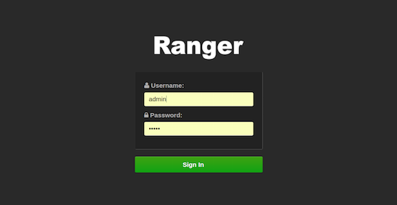
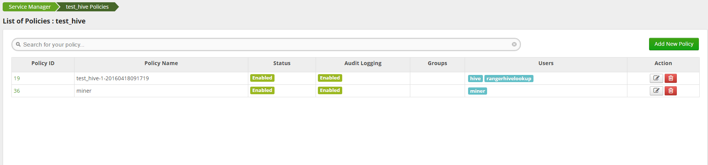

# Ranger使用指南
## 1.Ranger简介
Apache Ranger是由hortonworks主导贡献的开源项目，截至2016年6月，发行版本是0.6.0-SNAPSHO，仍然是Apache社区的孵化项目,相关链接：   
* [Ranger项目官网](http://ranger.apache.org/)
* [项目github地址](https://github.com/apache/incubator-ranger)
* [Hortonwork使用指南](http://docs.hortonworks.com/HDPDocuments/HDP2/HDP-2.3.2/bk_Ranger_User_Guide/content/ch01.html)

Ranger是一个致力于保障Hadoop平台安全的架构，在安全定义的管理(Administraition)、认证(Authentication)、授权(Authorization)、审计(Audit)、数据保护(Data Protection)五环中，Ranger实现除了认证以外的四环，认证由业界标准的Kerberos来实现，关于这五个环节的定义，可以参考Hortonwoks的描述：[Understanding Data Lake Security](http://docs.hortonworks.com/HDPDocuments/HDP2/HDP-2.3.2/bk_Ranger_User_Guide/content/understanding_data_lake_security.html).   
Ranger最大的优势是解决了Hadoop平台各个服务安全管理各自为政的现状，打造了一个集中统一的管理界面，为所有服务提供权限管理、日志审计等，减少了管理碎片化，极大方便了管理员对集群安全的监管，同时保证了所有服务的安全，即使是本身没有安全的服务，通过Ranger的插件实现，也可以纳入Ranger管理体系中。目前，Ranger原生支持的服务有：
* HDFS
* YARN
* HIVE
* HBASE
* KAFKA
* STORM
* SOLR
* KNOX

用户亦可通过实现Ranger相关接口，将第三方服务纳入Ranger管理。

## 2.Ranger结构

上图展示了Ranger结构组成，以及工作流程，下面简单介绍一下Ranger组件：
#### Ranger Admin
Ranger Admin以web网站的形式存在，主要为管理者提供了一个集中管理服务安全策略的可视化界面；其次提供日志审计的查看搜索(支持在数据库和HDFS存储日志，并使用solr索索)，所有敏感信息都得以查询；除此之外，Ranger还对外暴露了自己的RESTFul API，供第三方管理工具调用。
#### Ranger Plugins
Ranger实现各个服务安全策略的手段，通过服务暴露的接口(HDFS的hook，HBase的协处理器等)，实现Plugin，接管权限管理与日志审计。
#### Ranger UserSync
Ranger使用UserSync从LDAP将用户信息同步到Admin系统中，对这些用户进行管理，通常的流程是这样的：添加Kerberos用户->在LDAP添加对应用户->使用Ranger管理用户权限。

## 3.使用Ranger管理HDFS
HDFS本身拥有自身的权限管理，类似于linux文件权限，使用Ranger，其本身的权限管理将会失效，转由Ranger进行指定。所以，一个在hdfs上显示由tom用户创建的，700的文件，仍然可以由sandy随意读写，此时如果你感到疑惑，记住HDFS默认的权限已经不起作用，去Ranger Admin界面查看，检查相关权限设置。通过在hdfs-site.xml里设置`dfs.namenode.inode.attributes.provider.class=org.apache.ranger.authorization.hadoop.RangerHdfsAuthorizer`，Ranger接管了HDFS的权限管理。   
由于Hortonworks阵营多使用Ambari运维管理集群，Ranger安装配置主要由Ambari自动完成，所以不再深入讨论安装部署步骤，下面主要讲讲使用示例。

#### 访问Ranger Admin界面,输入用户名密码

#### 点击进入HDFS的一个repository,通常一个repository代表在一个集群的某个服务(这里是HDFS)

#### 点击Add New Policy添加一条权限策略

#### 填写相关属性，点击save保存

#### 注意事项
* HDFS拥有Read、Write、Execute三个选项
* 完全重复的Resource是不允许的
* Delegation Admin指的是用指定用户登录Ranger Admin是否可以操作这个策略

## 4.使用Ranger管理YARN
Ranger对于YARN的安全管理主要体现在队列queue的权限上，和YARN自身的权限保持一致，起到了一个替代的作用。通过在yarn-site.xml设置`yarn.authorization-provider=org.apache.ranger.authorization.yarn.authorizer.RangerYarnAuthorizer`，Ranger接管YARN的权限管理与日志审计，YARN原本的策略不再生效。
#### 访问Ranger Admin界面,输入用户名密码

#### 点击进入YARN的一个repository,通常一个repository代表在一个集群的某个服务(这里是YARN)

#### 点击Add New Policy添加一条权限策略

#### 填写相关属性，点击save保存

#### 注意事项
* YARN拥有submit-app、admin-queue两个选项
* 完全重复的Resource是不允许的
* Delegation Admin指的是用指定用户登录Ranger Admin是否可以操作这个策略

## 5.使用Ranger管理HBASE
HBASE定位是key-value数据库，自然也有自身的安全机制，和传统数据的权限管理类似，这里不再详细描述，而Ranger则是完美替代HBASE权限的同时，提供了建议的操作与可视化。通过在HBase-site.xml设置`hbase.coprocessor.region.classes=org.apache.ranger.authorization.hbase.RangerAuthorizationCoprocessor`以及`hbase.coprocessor.master.classes=org.apache.ranger.authorization.hbase.RangerAuthorizationCoprocessor`，Ranger接管HBase权限管理
#### 访问Ranger Admin界面,输入用户名密码

#### 点击进入HBASE的一个repository,通常一个repository代表在一个集群的某个服务(这里是HBASE)

#### 点击Add New Policy添加一条权限策略

#### 填写相关属性，点击save保存

#### 注意事项
* HBASE拥有Read、write、Create、Admin四个选项
* 完全重复的Resource是不允许的
* 权限控制粒度可到列级别
* Delegation Admin指的是用指定用户登录Ranger Admin是否可以操作这个策略

## 6.使用Ranger管理HIVE
Hive本身的权限管理非常繁琐，不便于操作管理，Ranger不仅提供了Hive权限的可视化界面，还扩展了Hive的权限粒度，可以到达列级别。通过设置`hive.security.authorization.manager=org.apache.ranger.authorization.hive.authorizer.RangerHiveAuthorizerFactory`,Ranger接管了Hive的权限管理。
#### 访问Ranger Admin界面,输入用户名密码

#### 点击进入HIVE的一个repository,通常一个repository代表在一个集群的某个服务(这里是HIVE)

#### 点击Add New Policy添加一条权限策略

#### 填写相关属性，点击save保存

#### 注意事项
* HIVE拥有Read、Write、Create、Drop、Lock、Alter、Index、All 8个行为选项
* 完全重复的Resource是不允许的
* 权限控制粒度可到列级别，还可以针对UDF进行控制
* Delegation Admin指的是用指定用户登录Ranger Admin是否可以操作这个策略

## 7.使用Ranger管理KAFKA
KAFKA通过ACl来设置Consumer或者Producer对topic的权限
#### 访问Ranger Admin界面,输入用户名密码

#### 点击进入KAFKA的一个repository,通常一个repository代表在一个集群的某个服务(这里是KAFKA)

#### 点击Add New Policy添加一条权限策略

#### 填写相关属性，点击save保存

#### 注意事项
* KAFKA拥有Publish、Consume、Configure、Describe、Kafka Admin 5个行为选项
* 完全重复的Resource是不允许的
* 可以限制访问ip范围
* Delegation Admin指的是用指定用户登录Ranger Admin是否可以操作这个策略

## 8.使用RANGER管理KNOX
Knox权限较为简单，只是判断用户是否有权利访问Knox相应的服务。
#### 访问Ranger Admin界面,输入用户名密码

#### 点击进入Knox的一个repository,通常一个repository代表在一个集群的某个服务(这里是Knox)

#### 点击Add New Policy添加一条权限策略

#### 填写相关属性，点击save保存

#### 注意事项
* Knox拥有Allow 1个行为选项
* 完全重复的Resource是不允许的
* 可以限制访问ip范围
* Delegation Admin指的是用指定用户登录Ranger Admin是否可以操作这个策略
