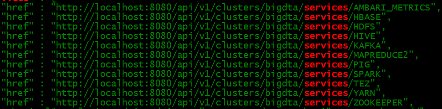
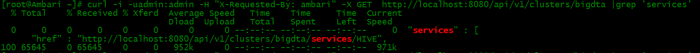
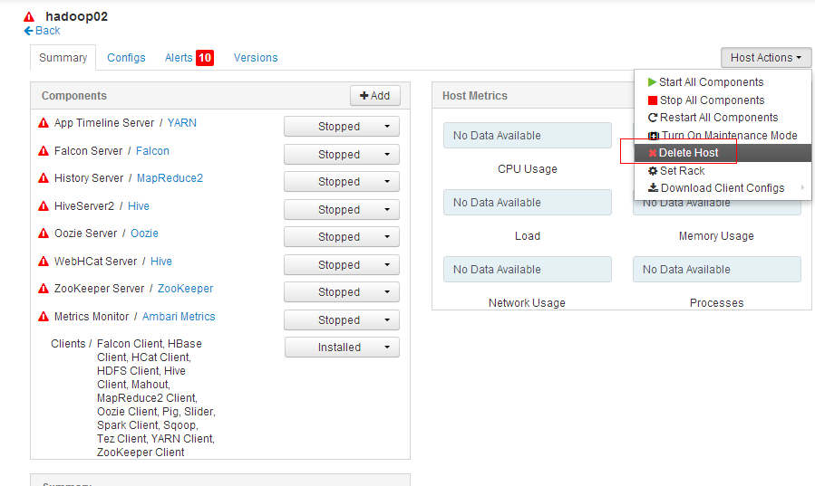

# Ambari剔除节点

http://www.ibm.com/developerworks/cn/opensource/os-cn-bigdata-ambari2/index.html

**利用Ambari剔除节点**

ambari-server中服务卸载

现在面板中停止要剔除节点上的所有服务

1).`# curl -i -uadmin:admin -H "X-Requested-By: ambari" -X GET  http://localhost:8080/api/v1/clusters/bigdta |grep 'services'`

开始卸载




```
# curl -u admin:admin -H "X-Requested-By: ambari" -X DELETE  http://localhost:8080/api/v1/clusters/bigdta/services/AMBARI_METRICS
#curl -u admin:admin -H "X-Requested-By: ambari" -X DELETE  http://localhost:8080/api/v1/clusters/bigdta/services/KAFKA
```
...

最后手动验证






