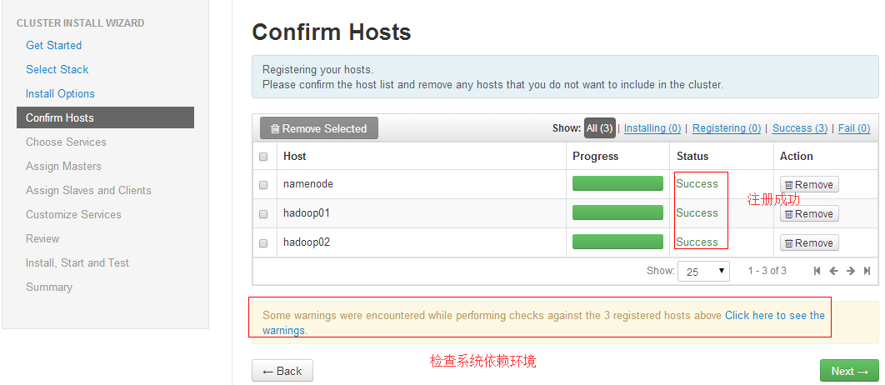

# Ambari搭建(通用)

## 基础环境

- 操作系统：CentOS6.7

- ambari版本：2.1.2
 
- HDP版本：2.3.2.0

- MySQL版本:5.1.73

## 主机规划

|主机名称 | IP地址 | 用途 | 备注 |
| :--- | :---- | :---- | :----|
| Ambari | 192.168.99.62 | Ambari服务器 |*         *|
|NameNode  |     192.168.99.63  |    NameNode服务器  |*         *|
| Hadoop01 |  192.168.99.64     |  Hadoop节点1    |*         *|
| Hadoop02 |     192.168.99.65  |   Hadoop节点2   |*         *|


## 目录规划

|目录名称 | 目录大小(推荐) | 备注 |
| :--- | :---- | :---- |
| /var | 300GB | 日志目录 |
|/data/sdv1  |  3TB左右  |Datanode目录|
| ... |  同上    | Datanode目录  |

## 参考文档

http://www.ibm.com/developerworks/cn/opensource/os-cn-bigdata-ambari/index.html

http://docs.hortonworks.com/HDPDocuments/Ambari/Ambari-2.2.1.0/index.html
**
第一、设置hosts文件**

在每个中主机的/etc/hosts文件依次加入IP和主机名，如图所示


**第二、主机参数优化及服务优化设置**


>注:此处的主机参数优化及服务设置主要是运行一个自动化的脚本，所做操作为安装集群前的准备工作，比如：防火墙关闭，操作liunx需要的一些基础命令等 
 

**第三、配置Ambari-server到agent单向的免密码登陆**

1、在Ambari-server节点执行生成公钥

     `# ssh-keygen -t rsa`


```
# chmod 700 .ssh/ && cd .ssh/
# cat id_rsa.pub >> authorized_keys
#chmod 600 authorized_keys

```

2、拷贝authorized_keys文件到目标主机

1)、 拷贝authorized_keys到namenode

(1)、在namenode上创建对应目录

```
#mkdir -p .ssh
# chmod 700 .ssh/
```
(2)、从server端拷贝文件到namenode

	`[root@Ambari .ssh]# scp authorized_keys root@namenode:/root/.ssh/`

2).拷贝authorized_keys到Hadoop01

(1)、在Hadoop01上创建对应目录

```
#mkdir -p .ssh
# chmod 700 .ssh/
```

(2)、从server端拷贝文件到Hadoop01

		`[root@Ambari .ssh]# scp authorized_keys root@Hadoop01:/root/.ssh/`

3).拷贝authorized_keys到Hadoop02

(1)、在Hadoop02上创建对应目录

```
#mkdir -p .ssh
# chmod 700 .ssh/
```

(2)、从server端拷贝文件到Hadoop02

	```[root@Ambari .ssh]# scp authorized_keys root@Hadoop02:/root/.ssh/```

3、结果验证

`[root@Ambari .ssh]# ssh Ambari date;ssh NameNode date;ssh Hadoop01 date;ssh Hadoop02 date;`

接连输入多次yes,有几个主机就输入几次yes


再次验证

`[root@Ambari .ssh]# ssh Ambari date;ssh NameNode date;ssh Hadoop01 date;`


至此，ssh配置和时间同步完成


**第四、Ambari-server私有yum源搭建及设置**

1、Nginx安装


>注：此处的Nginx是用yum来直接安装的，安装前先在 /etc/yum.repo.d/ 目录下查看并修改nginx.repo 文件的配置。

请参考

2、Nginx配置

```
# vi /usr/local/nginx/conf/nginx.conf
server {
              listen   8190;
              root /var/www/html;
              index index.htm;
              autoindex on;
				autoindex_exact_size off;
              autoindex_localtime on;
      }
```

重启Nginx服务

`#/etc/init.d/nginx restart`

3、安装createrepo工具

`#yum -y install createrepo`

4、创建Ambari的repo文件

`# mkdir -p /var/www/html`

登陆网址http://public-repo-1.hortonworks.com/

点击" Repository Home"

Ambari下载地址: http://s3.amazonaws.com/public-repo-1.hortonworks.com/index.html#/ambari/centos6/2.x/updates

HDP下载目录：http://s3.amazonaws.com/public-repo-1.hortonworks.com/index.html#/HDP/centos6/2.x

下载配对的

上传ambari-2.1.2-centos6.tar.gz到/var/www/html目录下并解压

```
#cd /var/www/html
#tar xf ambari-2.1.2-centos6.tar.gz
#mv ambari-2.1.2 ambari
#createrepo /var/www/html/ambari
```


5、创建HDP组件公共文件配置

上传HDP-2.3.2.0-centos6-rpm.tar.gz到/var/www/html目录下并解压

```
#cd /var/www/html
#tar xf HDP-2.3.2.0-centos6-rpm.tar.gz
#createrepo /var/www/html/HDP
```


6、创建HDP-UTILS组件公共文件配置

上传HDP-UTILS-1.1.0.20-centos6.tar.gz到/var/www/html目录下并解压

```
#tar xf HDP-UTILS-1.1.0.20-centos6.tar.gz
#mv  HDP-UTILS-1.1.0.20  HDP-UTILS
#createrepo /var/www/html/HDP-UTILS
```


7、编辑并拷贝repo文件到每个节点上

1)、ambari.repo编辑

```
# cat ambari.repo
[Updates-ambari-2.1.2]
name=ambari-2.1.2 - Updates
baseurl=http://192.168.99.62:8190/ambari/
gpgcheck=0
```
2)、HDP.repo编辑

```
#cat HDP.repo
[HDP-2.3]
name=HDP-2.3
baseurl=http://192.168.99.62:8190/HDP/centos6/2.x/updates/2.3.2.0/
path=/
enabled=1
gpgcheck=0
```

3)、HDP-UTILS.repo编辑

```
#cat HDP-UTILS.repo
[HDP-UTILS-1.1.0.20]
name=HDP-UTILS-1.1.0.20
baseurl=http://192.168.99.62:8190/HDP-UTILS/repos/centos6/
path=/
enabled=1
gpgcheck=0
```

4)、验证3个repo文件是否配置正确

(1)、先拷贝3个repo文件到本机/etc/yum.repos.d/目录下

`# \cp *.repo /etc/yum.repos.d/`

(2)、在本机上验证repo文件是否配置正确

```
#yum clean all
#yum repolist
```


注意查看3个repo文件的status值不为0即可

(3)、分别拷贝3个repo文件到各个节点的/etc/yum.repos.d/目录下

```
# scp *.repo namenode:/etc/yum.repos.d/
# scp *.repo hadoop01:/etc/yum.repos.d/
# scp *.repo hadoop02:/etc/yum.repos.d/
```

(4)、(可选操作)可在每个主机上分别执行yum命令检测配置的yum源

```
# yum clean all
# yum repolist
```


**第五步、Ambari-server安装与启动**

1、检测ambari-server配置

```
#yum clean all
#yum list|grep ambari
```


2、安装ambari Server

`# yum -y install ambari-server`

3、配置ambari Server

1)、上传安装包到Ambari的resources目录下

 `#cd /var/lib/ambari-server/resources`

上传jce_policy-8.zip、jdk-8u40-linux-x64.tar.gz

2)、配置postgresql自启动

`#chkconfig --level 35 postgresql on`

3)、执行对应配置

`# ambari-server setup`


数据库密码为:123456

4)、配置无误后，启动服务

```
[root@Ambari ~]# ambari-server start
[root@Ambari ~]# ambari-server status
```


`[root@Ambari ~]# lsof -i:8080`


检查异常请及时查看/var/log/ambari-server/ambari-server.log文件

5)、登陆web验证

登陆http://ip:8080

使用账号:admin密码:admin

<font color=red size=5>特别注意：安装过程中不可随意关闭浏览器网页，可能会导致安装失败</font>


至此，Ambari-server部署完成

**第六步、利用Ambari搭建Hadoop集群**

登陆http://ip:8080,点击向导开始配置


1、集群命名


2、选择Stack，Stack相当于Hadoop生态圈软件的集合。

1)、选择HDP生态圈版本号:

Stack的版本越高，里面的软件版本也就越高。这里我们选择HDP2.3里面的对应的Hadoop版本为 2.6.x。


2)、点击"Advanced Repository Options"选项开始配置yum库文件地址

注意：本地址必须依靠参考HDP.repo、HDP-UTILS.repo文件进行配置


>注：此处图片中的链接地址的设定和私有yum源搭建的7小节中repo文件中的路径设置保持一致

3、Ambari-agent注册

保险情况下，推荐手动注册即手动安装客户端并修改对应配置文件


1)、namenode节点ambari-agent安装

```
[root@namenode ~]# yum install -y ambari-agent
[root@namenode ~]# vi /etc/ambari-agent/conf/ambari-agent.ini
```

修改其中的hostname为Ambari即可

```
[root@namenode ~]# /etc/init.d/ambari-agent start
[root@NameNode ~]# /etc/init.d/ambari-agent status
```


2)、Hadoop01节点ambari-agent安装

```
[root@Hadoop01 ~]# yum install -y ambari-agent
[root@Hadoop01~]#  vi /etc/ambari-agent/conf/ambari-agent.ini
```

修改其中的hostname为Ambari即可

```
[root@Hadoop01 ~]# /etc/init.d/ambari-agent start
[root@Hadoop01 ~]# /etc/init.d/ambari-agent status
```


3)、Hadoop02节点ambari-agent安装

```
[root@Hadoop02~]# yum install -y ambari-agent
[root@Hadoop02 ~]# vi /etc/ambari-agent/conf/ambari-agent.ini
[root@Hadoop02 ~]# /etc/init.d/ambari-agent start
[root@Hadoop02 ~]# /etc/init.d/ambari-agent status
```


4)、客户端手动注册

点击"Register and Confirm"后系统自动开始注册主机和配置主机



注册完成后,系统自动进行主机检查配置环境检查

4、Hadoop集群组件选择与安装

开始选择安装的服务：(一般根据业务选择安装的服务)

1)、目前不安装的组件有

Atlas
Knox
Slider
Accumulo
Storm
Oozie
Faclon


 2)、master服务节点选择

选择各组件master服务安装在哪些节点

注意：

服务分为master/salves

多个master不推荐安装在同一个主机上面


 3)、slaves服务节点选择

选择slaves服务的安装节点，节点客户端安装

一般推荐DataNode、RegionServe、client组件都安装


 4)、自定义服务配置

(1)、hdfs目录配置：

注意检查目录空间大小，尽量放置在大的目录下


(2)、hive服务配置与检测


5、配置信息检查


6、组件安装、启动、和测试

安装过程(1)、


	
安装过程(2)、


	
安装过程(3)、


	
安装过程(4)、


	
安装过程(5)、


	
安装过程(6)、


安装完成


安装完成，有异常会如图提示


**第七、异常问题解决**

常见错误


依次修改各个节点arams.py

`#vi /var/lib/ambari-agent/cache/stacks/HDP/2.0.6/hooks/before-START/scripts/params.py`

将131行的

`ambari_db_rca_password = config['hostLevelParams']['ambari_db_rca_password'] [0]`的[0]删除然后重启节点,异常消失


   


