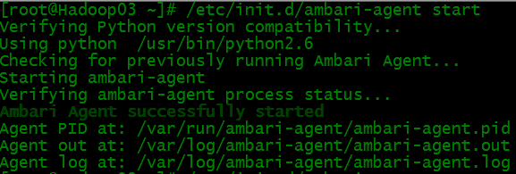

# Ambari添加节点

## 操作说明

- 操作系统:CentOS6.7

前置准备

1).配置ssh

2).主机规划

IP：192.168.99.63

hostname:Hadoop03

3).配置/etc/hosts

4).JDK环境部署

5).repo文件复制


```
[root@Ambari html]# scp *.repo root@hadoop03:/etc/yum.repos.d/
[root@Hadoop03 ~]# yum repolist
```


第一、手动安装Ambari-agent

```
[root@Hadoop03 ~]# yum -y install ambari-agent
[root@Hadoop03 ~]# vi /etc/ambari-agent/conf/ambari-agent.ini
[root@Hadoop03 ~]# /etc/init.d/ambari-agent start
```



`[root@Hadoop03 ~]# /etc/init.d/ambari-agent status`


开启服务


