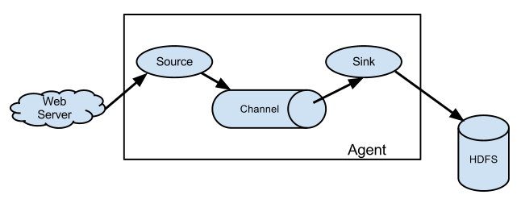

# Flume使用说明文档

导读：   
1. flume的原理  
2. flume 的核心    
3. flume 使用实例   
4. 附录 

## 一、flume的原理  
### 1.1flume介绍  
Flume NG是Cloudera提供的一个分布式、可靠、可用的系统，它能够将不同数据源的海量日志数据进行高效收集、聚合、移动，最后存储到一个中心化数据存储系统中。由原来的Flume OG到现在的Flume NG，进行了架构重构，并且现在NG版本完全不兼容原来的OG版本。经过架构重构后，Flume NG更像是一个轻量的小工具，非常简单，容易适应各种方式日志收集，并支持failover和负载均衡。

Flume 使用 java 编写，其需要运行在 Java1.6 或更高版本之上。

### 1.2 flume 的架构 

Flume的架构主要有一下几个核心概念：  
- Event：一个数据单元，带有一个可选的消息头  
- Flow：Event从源点到达目的点的迁移的抽象  
- Client：操作位于源点处的Event，将其发送到Flume Agent  
- Agent：一个独立的Flume进程，包含组件Source、Channel、Sink  
- Source：用来消费传递到该组件的Event  
- Channel：中转Event的一个临时存储，保存有Source组件传递过来的Event  
- Sink：从Channel中读取并移除Event，将Event传递到Flow Pipeline中的下一个Agent（如果有的话）  

Flume 的核心是把数据从数据源收集过来，再送到目的地。为了保证输送一定成功，在送到目的地之前，会先缓存数据，待数据真正到达目的地后，删除自己缓存的数据。

Flume 传输的数据的基本单位是 Event，如果是文本文件，通常是一行记录，这也是事务的基本单位。Event 从 Source，流向 Channel，再到 Sink，本身为一个 byte 数组，并可携带 headers 信息。Event 代表着一个数据流的最小完整单元，从外部数据源来，向外部的目的地去。

Flume 运行的核心是 Agent。它是一个完整的数据收集工具，含有三个核心组件，分别是 source、channel、sink。通过这些组件，Event 可以从一个地方流向另一个地方，

其具体的构件图为：  

    

-   source 可以接收外部源发送过来的数据。不同的 source，可以接受不同的数据格式。比如有目录池(spooling directory)数据源，可以监控指定文件夹中的新文件变化，如果目录中有文件产生，就会立刻读取其内容.  
-   channel 是一个存储地，接收 source 的输出，直到有 sink 消费掉 channel 中的数据。channel 中的数据直到进入到下一个channel中或者进入终端才会被删除。当 sink 写入失败后，可以自动重启，不会造成数据丢失，因此很可靠。  
-   sink 会消费 channel 中的数据，然后送给外部源或者其他 source。如数据可以写入到 HDFS 或者 HBase 中。  

## 二、flume的核组件

flume的核心————agent；flume的工作就是运行agent来达到数据处理的效果。使用flume的标准就是熟练的配置各种agent。  

### 2.1 source  

Client端操作消费数据的来源，Flume 支持 Avro，log4j，syslog 和 http post(body为json格式)。可以让应用程序同已有的Source直接打交道，如AvroSource，SyslogTcpSource。也可以 写一个 Source，以 IPC 或 RPC 的方式接入自己的应用，Avro和 Thrift 都可以(分别有 NettyAvroRpcClient 和 ThriftRpcClient 实现了 RpcClient接口)，其中 Avro 是默认的 RPC 协议。具体代码级别的 Client 端数据接入，可以参考官方手册。

对现有程序改动最小的使用方式是使用是直接读取程序原来记录的日志文件，基本可以实现无缝接入，不需要对现有程序进行任何改动。 对于直接读取文件 Source,有两种方式：

ExecSource: 以运行 Linux 命令的方式，持续的输出最新的数据，如 tail -F 文件名 指令，在这种方式下，取的文件名必须是指定的。 ExecSource 可以实现对日志的实时收集，但是存在Flume不运行或者指令执行出错时，将无法收集到日志数据，无法保证日志数据的完整性。
SpoolSource: 监测配置的目录下新增的文件，并将文件中的数据读取出来。需要注意两点：拷贝到 spool 目录下的文件不可以再打开编辑；spool 目录下不可包含相应的子目录。
SpoolSource 虽然无法实现实时的收集数据，但是可以使用以分钟的方式分割文件，趋近于实时。

如果应用无法实现以分钟切割日志文件的话， 可以两种收集方式结合使用。 在实际使用的过程中，可以结合 log4j 使用，使用 log4j的时候，将 log4j 的文件分割机制设为1分钟一次，将文件拷贝到spool的监控目录。

log4j 有一个 TimeRolling 的插件，可以把 log4j 分割文件到 spool 目录。基本实现了实时的监控。Flume 在传完文件之后，将会修改文件的后缀，变为 .COMPLETED（后缀也可以在配置文件中灵活指定）。

Flume Source 支持的类型将一一介绍。  

- fileSource ：  
- kafkaSource ： 
-  .....  ： 

### 2.2、channel    

当前有几个 channel 可供选择，分别是 Memory Channel, JDBC Channel , File Channel，Psuedo Transaction Channel。比较常见的是前三种 channel。

MemoryChannel 可以实现高速的吞吐，但是无法保证数据的完整性。

MemoryRecoverChannel 在官方文档的建议上已经建义使用FileChannel来替换。

FileChannel保证数据的完整性与一致性。在具体配置FileChannel时，建议FileChannel设置的目录和程序日志文件保存的目录设成不同的磁盘，以便提高效率。

File Channel 是一个持久化的隧道（channel），它持久化所有的事件，并将其存储到磁盘中。因此，即使 Java 虚拟机当掉，或者操作系统崩溃或重启，再或者事件没有在管道中成功地传递到下一个代理（agent），这一切都不会造成数据丢失。Memory Channel 是一个不稳定的隧道，其原因是由于它在内存中存储所有事件。如果 java 进程死掉，任何存储在内存的事件将会丢失。另外，内存的空间收到 RAM大小的限制,而 File Channel 这方面是它的优势，只要磁盘空间足够，它就可以将所有事件数据存储到磁盘上。

### 2.3、sink   
Sink在设置存储数据时，可以向文件系统、数据库、hadoop存数据，在日志数据较少时，可以将数据存储在文件系中，并且设定一定的时间间隔保存数据。在日志数据较多时，可以将相应的日志数据存储到Hadoop中，便于日后进行相应的数据分析。

Flume Sink支持的类型：  
- HDFS Sink:  
- Hive Sink :   
- Logger Sink:   
- Avro Sink  
- Thrift Sink  
- HBaseSink  
- 自定义sink

更多参见[http://flume.apache.org/FlumeUserGuide.html](http://flume.apache.org/FlumeUserGuide.html)

## 三、flume使用实例

### 3.1 实例一    
 
	//agent1表示代理名称
	agent1.sources=source1
	agent1.sinks=sink1
	agent1.channels=channel1
 
 
	//Spooling Directory是监控指定文件夹中新文件的变化，一旦新文件出现，就解析该文件内容，然后写入到channle。写入完成后，标记该文件已完成或者删除该文件。
	//配置source1
	agent1.sources.source1.type=spooldir
	agent1.sources.source1.spoolDir=/root/hmbbs
	agent1.sources.source1.channels=channel1
	agent1.sources.source1.fileHeader = false
	agent1.sources.source1.interceptors = i1
	agent1.sources.source1.interceptors.i1.type = timestamp
 
	//配置sink1
	agent1.sinks.sink1.type=hdfs
	agent1.sinks.sink1.hdfs.path=hdfs://hadoop0:9000/hmbbs
	agent1.sinks.sink1.hdfs.fileType=DataStream
	agent1.sinks.sink1.hdfs.writeFormat=TEXT
	agent1.sinks.sink1.hdfs.rollInterval=1
	agent1.sinks.sink1.channel=channel1
	agent1.sinks.sink1.hdfs.filePrefix=%Y-%m-%d
 
	//配置channel1
	agent1.channels.channel1.type=file
	agent1.channels.channel1.checkpointDir=/root/hmbbs_tmp/123
	agent1.channels.channel1.dataDirs=/root/hmbbs_tmp/

注：此处的source是spooldir

 

## 四、附录

参考文档：  

- [http://flume.apache.org/](http://flume.apache.org/ "flume官网")   
- 

 

