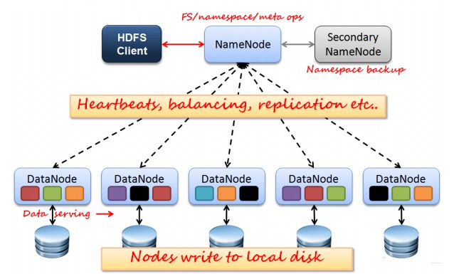
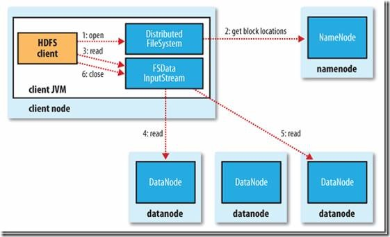
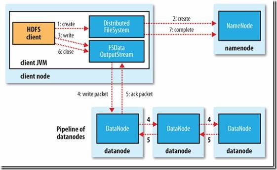

# HDFS 的使用文档  


## 导读
1. hdfs的原理、特点  
2. hdfs的常用命令
3. hdfs的java api及实例
4. hdfs在kerberos安全模式下使用实例


## 一、HDFS的原理、特点   

### 1.1 HDFS的设计原理  
HDFS（Hadoop Distributed File System）是一个分布式文件系统，是谷歌的GFS山寨版本。它具有高容错性并提供了高吞吐量的数据访问，非常适合大规模数据集上的应用，它提供了一个高度容错性和高吞吐量的海量数据存储解决方案。  


### 1.2 HDFS特点  

-	高吞吐量访问：HDFS的每个Block分布在不同的Rack上，在用户访问时，HDFS会计算使用最近和访问量最小的服务器给用户提供。由于Block在不同的Rack上都有备份，所以不再是单数据访问，所以速度和效率是非常快的。另外HDFS可以并行从服务器集群中读写，增加了文件读写的访问带宽。  
-	高容错性：系统故障是不可避免的，如何做到故障之后的数据恢复和容错处理是至关重要的。HDFS通过多方面保证数据的可靠性，多份复制并且分布到物理位置的不同服务器上，数据校验功能、后台的连续自检数据一致性功能都为高容错提供了可能。  
-	线性扩展：因为HDFS的Block信息存放到NameNode上，文件的Block分布到DataNode上，当扩充的时候仅仅添加DataNode数量，系统可以在不停止服务的情况下做扩充，不需要人工干预。


### 1.3 HDFS的体系结构  
  

如上图所示HDFS是Master和Slave的结构，分为NameNode、Secondary NameNode和DataNode三种角色。
- NameNode：在Hadoop1.X中只有一个Master节点，管理HDFS的名称空间和数据块映射信息、配置副本策略和处理客户端请求；  
- Secondary NameNode：辅助NameNode，分担NameNode工作，定期合并fsimage和fsedits并推送给NameNode，紧急情况下可辅助恢复 NameNode；  
- DataNode：Slave节点，实际存储数据、执行数据块的读写并汇报存储信息给NameNode；

### 1.4 写操作与读操作  
**1.2.1 HDFS读操作**  

   

1.  客户端通过调用FileSystem对象的open()方法来打开希望读取的文件，对于HDFS来说，这个对象时分布文件系统的一个实例；  
2.  DistributedFileSystem通过使用RPC来调用NameNode以确定文件起始块的位置，同一Block按照重复数会返回多个位置，这些位置按照Hadoop集群拓扑结构排序，距离客户端近的排在前面；  
3.  前两步会返回一个FSDataInputStream对象，该对象会被封装成DFSInputStream对象，DFSInputStream可以方便的管理datanode和namenode数据流，客户端对这个输入流调用read()方法；  
4.  存储着文件起始块的DataNode地址的DFSInputStream随即连接距离最近的DataNode，通过对数据流反复调用read()方法，可以将数据从DataNode传输到客户端；  
5.  到达块的末端时，DFSInputStream会关闭与该DataNode的连接，然后寻找下一个块的最佳DataNode，这些操作对客户端来说是透明的，客户端的角度看来只是读一个持续不断的流；  
6.  一旦客户端完成读取，就对FSDataInputStream调用close()方法关闭文件读取。


**1.2.2 HDFS写操作**   

  


1.     客户端通过调用DistributedFileSystem的create()方法创建新文件；
2.     DistributedFileSystem通过RPC调用NameNode去创建一个没有Blocks关联的新文件，创建前NameNode会做各种校验，比如文件是否存在、客户端有无权限去创建等。如果校验通过，NameNode会为创建新文件记录一条记录，否则就会抛出IO异常；
3.     前两步结束后会返回FSDataOutputStream的对象，和读文件的时候相似，FSDataOutputStream被封装成DFSOutputStream，DFSOutputStream可以协调NameNode和Datanode。客户端开始写数据到DFSOutputStream，DFSOutputStream会把数据切成一个个小的数据包，并写入内部队列称为“数据队列”(Data Queue)；
4.     DataStreamer会去处理接受Data Queue，它先问询NameNode这个新的Block最适合存储的在哪几个DataNode里，比如重复数是3，那么就找到3个最适合的DataNode，把他们排成一个pipeline.DataStreamer把Packet按队列输出到管道的第一个Datanode中，第一个DataNode又把Packet输出到第二个DataNode中，以此类推；
5.     DFSOutputStream还有一个对列叫Ack Quene，也是有Packet组成，等待DataNode的收到响应，当Pipeline中的所有DataNode都表示已经收到的时候，这时Akc Quene才会把对应的Packet包移除掉；
6.     客户端完成写数据后调用close()方法关闭写入流；
7.     DataStreamer把剩余的包都刷到Pipeline里然后等待Ack信息，收到最后一个Ack后，通知NameNode把文件标示为已完成。

## 二、HDFS常用命令  

    hadoop fs -ls /     **查看hdfs根目录下有多少文件，目录。**
	hadoop fs -lsr      **遍历查看hdfs中的文件 **
	hadoop fs -mkdir /user/hadoop   **创建目录hadoop**
	hadoop fs -put a.txt /user/hadoop/   上传文件a.txt 到hadoop目录中**
	hadoop fs -get /user/hadoop/a.txt /  下载文件到本地
	hadoop fs -cp src dst   **拷贝文件到其他目录**
	hadoop fs -mv src dst   **移动文件到其他目录**
	hadoop fs -cat /user/hadoop/a.txt  **查看文件内容**
	hadoop fs -rm /user/hadoop/a.txt   **删除文件**
	hadoop fs -rmr /user/hadoop/a.txt  **递归删除所有文件目录**
	hadoop fs -text /user/hadoop/a.txt  **和cat类似、查看文件内容
	hadoop fs -copyFromLocal localsrc dst 与hadoop fs -put功能类似。 
	hadoop fs -moveFromLocal localsrc dst 将本地文件上传到hdfs，同时删除本地文件。  

更多hdfs的命令操作请参考链接：  
[https://hadoop.apache.org/docs/stable/hadoop-project-dist/hadoop-common/FileSystemShell.html](https://hadoop.apache.org/docs/stable/hadoop-project-dist/hadoop-common/FileSystemShell.html "hdfs shell命令") 


## 三、HDFS java实例  

### 3.1 引入依赖

首先先引入相关的依赖：  
 
	<!--下载依赖包所依据的第三方私有源位置-->
    <repositories>
        <repository>
            <id>nodpi</id>
            <name>nodpi Releases</name>
            <url>http://nexus.odpi.org:8081/nexus/content/groups/public</url>
            <layout>default</layout>
        </repository>
        <repository>
            <id>HDPReleases</id>
            <name>HDP Releases</name>
            <url>http://repo.hortonworks.com/content/repositories/releases/</url>
            <layout>default</layout>
        </repository>
    </repositories>
    <properties>
    </properties>
	<!--具体依赖-->
    <dependencies>
        <!--hdfs-->
        <dependency>
            <groupId>org.apache.hadoop</groupId>
            <artifactId>hadoop-client</artifactId>
            <version>2.7.1.2.3.2.0-2950</version>
        </dependency>
    </dependencies>
	<!--编译配置-->
    <build>
        <plugins>
            <plugin>
                <artifactId>maven-compiler-plugin</artifactId>
                <version>3.1</version>
                <configuration>
                    <source>1.8</source>
                    <target>1.8</target>
                </configuration>
            </plugin>
        </plugins>
    </build>


注意： 相应架包的版本号与自己集群上的hadoop保持一致。  

### 3.2 api介绍  
 
FileSystem ： 操作hdfs上文件的主体类，提供了很多方法来操作具体的文件；  
 
-  mkdir(Path path)  :传入路径来操作创建目录。  
-  deletePath path）:传入路径，删除传入的文件  
-  create(Path path) : 传入路径来创建一个输出流。  
-  open(Path path) : 打开一个文件，创建输入流。 
-  rename（Path oldPath,Path targetPath） : 重命名文件  


更详细api 请看链接：  
[https://hadoop.apache.org/docs/stable/api/index.html](https://hadoop.apache.org/docs/stable/api/index.html "hadoop 的链接") 
  

### 3.3 HDFS示例代码  
示例代码：  
```java
	//创建新文件
     public static void createFile(String dst , byte[] contents) throws IOException{
         Configuration conf = new Configuration(); //实例化配置
         FileSystem fs = FileSystem.get(conf);//引入配置实例化文件系统
         Path dstPath = new Path(dst); //目标路径
        //打开一个输出流
         FSDataOutputStream outputStream = fs.create(dstPath);
         outputStream.write(contents);
         outputStream.close();
         fs.close();
         System.out.println("文件创建成功！");
     }
     
     //上传本地文件
     public static void uploadFile(String src,String dst) throws IOException{
         Configuration conf = new Configuration();
         FileSystem fs = FileSystem.get(conf);
         Path srcPath = new Path(src); //原路径
         Path dstPath = new Path(dst); //目标路径
         //调用文件系统的文件复制函数,前面参数是指是否删除原文件，true为删除，默认为false
         fs.copyFromLocalFile(false,srcPath, dstPath);
         
         //打印文件路径
         System.out.println("Upload to "+conf.get("fs.default.name"));
         System.out.println("------------list files------------"+"\n");
         FileStatus [] fileStatus = fs.listStatus(dstPath);
         for (FileStatus file : fileStatus) 
         {
           System.out.println(file.getPath());
         }
         fs.close();
     }
     
     //文件重命名
     public static void rename(String oldName,String newName) throws IOException{
         Configuration conf = new Configuration();
         FileSystem fs = FileSystem.get(conf);
         Path oldPath = new Path(oldName);
         Path newPath = new Path(newName);
         boolean isok = fs.rename(oldPath, newPath);
         if(isok){
             System.out.println("rename ok!");
         }else{
             System.out.println("rename failure");
         }
         fs.close();
     }
     //删除文件
     public static void delete(String filePath) throws IOException{
         Configuration conf = new Configuration();
         FileSystem fs = FileSystem.get(conf);
         Path path = new Path(filePath);
         boolean isok = fs.deleteOnExit(path);
         if(isok){
             System.out.println("delete ok!");
         }else{
             System.out.println("delete failure");
         }
         fs.close();
     }
     
     //创建目录
     public static void mkdir(String path) throws IOException{
         Configuration conf = new Configuration();
         FileSystem fs = FileSystem.get(conf);
         Path srcPath = new Path(path);
         boolean isok = fs.mkdirs(srcPath);
         if(isok){
             System.out.println("create dir ok!");
         }else{
             System.out.println("create dir failure");
         }
         fs.close();
     }
     
     //读取文件的内容
     public static void readFile(String filePath) throws IOException{
         Configuration conf = new Configuration();
         FileSystem fs = FileSystem.get(conf);
         Path srcPath = new Path(filePath);
         InputStream in = null;
         try {
             in = fs.open(srcPath);
             IOUtils.copyBytes(in, System.out, 4096, false); //复制到标准输出流
         } finally {
             IOUtils.closeStream(in);
         }
     } 
```


>注：  
>1.在客户端写代码操作hdfs文件时；先要引入hdfs的配置文件到 resource目录中。或者对Configuration 的实例化对象做配置项设置；    
>2. 客户端操作hdfs文件容易报权限错误的问题；一般是因为服务器端的hdfs的权限是hdfs 而客户端若你不设置“HADOOP_USER_NAME”的环境变量则默认是电脑的用户名。最好设置这个环境变量，其值一般是 ‘hdfs’。


## 四、hdfs在kerberos安全模式下使用实例 

>注：此处的安全模式是指集群使用了基于kerberos+ranger+knox+ldap的安全策略。


### 4.1 依赖  

版本：此处使用的经过第三方(hortonworks)重构的架包；具体依赖如下： 

	
    <dependencies>
        <!--hdfs-->
        <dependency>
            <groupId>org.apache.hadoop</groupId>
            <artifactId>hadoop-client</artifactId>
            <version>2.7.1.2.3.2.0-2950</version>
        </dependency>
    </dependencies> 
	

### 4.2 客户端安全认证 


在此模式下访问hdfs前需要做安全认证，具体的认证方式如下：  
1. 添加配置文件：主要指先从ambari界面下载hdfs的配置文件，放入工程项目的resources 目录下，相应的还要添加krb5.conf 和 XX.keytab(相当于kerberos的密钥)放入此目录。  
2. 设置org.apache.hadoop.conf.Configuration 的具体配置，主要是添加步骤1中的keytab文件和其对应的principal（具体看实例）  
3. 安全认证登陆，使用SecurityUtil类的login方法实现。  
4. 开始实例化FileSystem使用hdfs。 


>注：在运行前需要 运行 System.setProperty("java.security.krb5.conf"，krb5.conf path);来初始化基础配置（这一步是在windows上才需要，在liunx服务器上则不需要）。  

### 4.3 示例代码  
```java
    private static final Logger logger = Logger.getLogger(HdfsTest.class);
    private final String KEYTAB_FILE_KEY = "hdfs.keytab.file";
    private final String USER_NAME_KEY = "hdfs.kerberos.principal";
    private Configuration configuration;

    public HdfsTest() throws IOException {
        configuration = new Configuration();
        configuration.set(KEYTAB_FILE_KEY, "C:\\Users\\Administrator\\Desktop\\test\\src\\main\\resources\\liweiqi.keytab");//设置keytab文件
        configuration.set(USER_NAME_KEY, "liweiqi@hadoop");//设置keytab文件的principal
    }
	
	//测试安全模式先rpc是否正常连通
    private void rpcTest() throws IOException {
        SecurityUtil.login(configuration, KEYTAB_FILE_KEY, USER_NAME_KEY);//开始认证
        FileSystem fs = FileSystem.get(configuration);
        FileStatus status = fs.getFileStatus(new Path("/liweiqi"));
        logger.info(status.getPermission().toString());
        fs.close();
    }

	//测试安全模式下http访问是否能正常连通
    private void httpTest() throws IOException, AuthenticationException, URISyntaxException {
        SecurityUtil.login(configuration, KEYTAB_FILE_KEY, USER_NAME_KEY);
        WebHdfsFileSystem webHdfsFileSystem = (WebHdfsFileSystem) FileSystem.get(new URI("webhdfs://hadoop01.domain:50070/"), configuration);
        webHdfsFileSystem.setConf(configuration);
        FileStatus status = webHdfsFileSystem.getFileStatus(new Path("webhdfs://hadoop01.domain:50070/liweiqi"));
        logger.info(status.getPermission().toString());
        webHdfsFileSystem.close();
    }

    @Override
    public void test() throws Exception {
        System.setProperty("java.security.krb5.conf", "C:\\Users\\Administrator\\Desktop\\test\\src\\main\\resources\\krb5.conf");//初始化基础的安全配置
        httpTest();
        rpcTest();
    }
```


    
  

 

