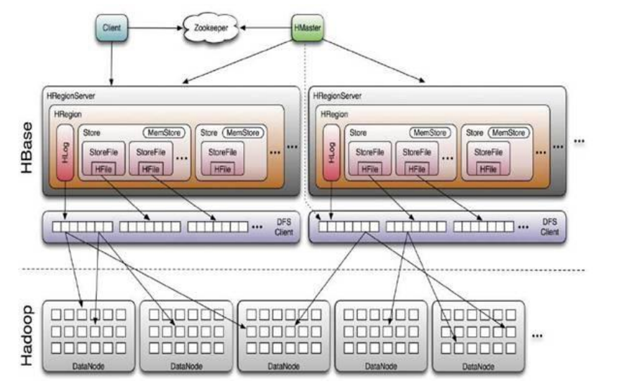
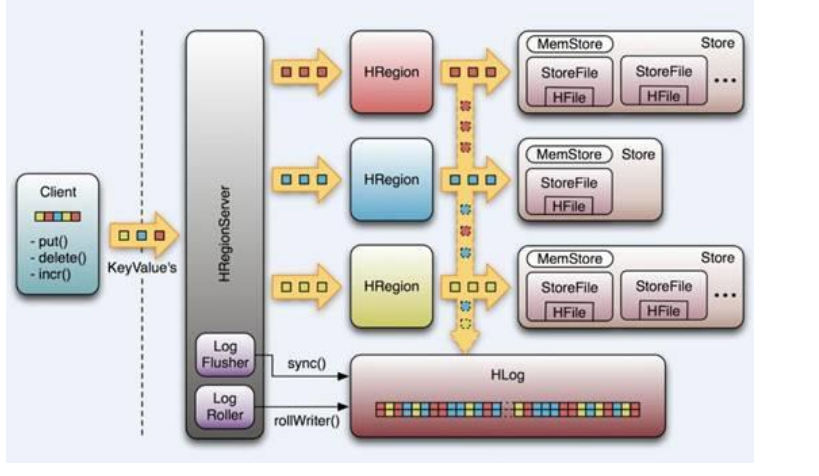
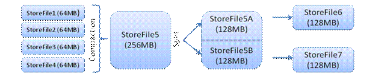
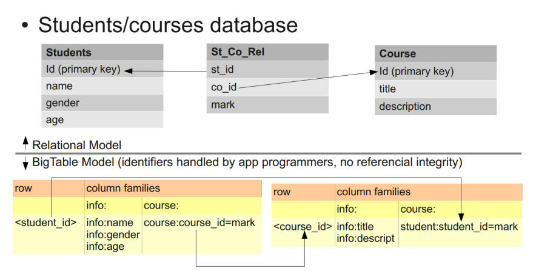

# Hbase简介

导读  


1. 简介  
2. 客户端访问hbase实例   
3. hbase在kerberos安全模式下使用实例    
4. 系统架构    
5. Hbase的数据模型

  

## 一、简介 

HBase 是一个以Google 的Bigtable 为模型、开源、非关系型、分布式数据库。HBase 属于Hadoop 一部分，以HDFS 为存储基础，提供了类似Bigtable的功能。HBase 有如下特点：  

- 具有线性以及模块化的扩展能力 
- 提供读写操作的严格一致性  
- 支持自动和自定义的表分片  
- 自动的节点容错  
- 与MapReduce 易于集成  
- 提供方便的Java API  
- 为实时查询提供块缓存以及Bloom Filter  
- 通过Side Filter 可实现查询谓语下推  
- 以Eric Brewer 的CAP 准则进行分类，HBase 属于CP 类型系统。 
 


## 二、客户端访问hbase实例

### 2.1 依赖 

	<!--第三方私有源位置-->
    <repositories>
        <repository>
            <releases>
                <enabled>true</enabled>
                <updatePolicy>always</updatePolicy>
                <checksumPolicy>warn</checksumPolicy>
            </releases>
            <snapshots>
                <enabled>false</enabled>
                <updatePolicy>never</updatePolicy>
                <checksumPolicy>fail</checksumPolicy>
            </snapshots>
            <id>HDPReleases</id>
            <name>HDP Releases</name>
            <url>http://repo.hortonworks.com/content/repositories/releases/</url>
            <layout>default</layout>
        </repository>
    </repositories>
    <!--具体依赖-->
    <dependencies>
        <dependency>
            <groupId>org.apache.hbase</groupId>
            <artifactId>hbase-common</artifactId>
            <version>1.1.2.2.3.2.0-2950</version>
        </dependency>
        <dependency>
            <groupId>org.apache.hadoop</groupId>
            <artifactId>hadoop-client</artifactId>
            <version>2.7.1.2.3.2.0-2950</version>
        </dependency>
        <dependency>
            <groupId>org.apache.hbase</groupId>
            <artifactId>hbase-client</artifactId>
            <version>1.1.2.2.3.2.0-2950</version>
        </dependency>
    </dependencies>
    <!--编译配置-->
    <build>
        <plugins>

            <plugin>
                <artifactId>maven-compiler-plugin</artifactId>
                <version>3.1</version>
                <configuration>
                    <source>1.8</source>
                    <target>1.8</target>
                </configuration>
            </plugin>
        </plugins>
    </build>
 
>注：hbase的version是 经第三方hortonworks 处理后得到的小版本。具体与集群保持一致；此处的hbase-version 是1.1.2.2.3.2.0-2950 ；

### 2.2 客户端连接步骤  

在代码编写前要进行以下检查和操作：  
1. 确保客户机的host文件中添加了服务器的ip及hostName  
2. 在idea 的maven项目中引入5.1 的依赖（依赖的版本依据自己集群中服务的具体安装版本来定）。  
3. 引入配置文件；在ambari web界面下载hdfs 和hbase 的配置文件，将具体的 .xml配置文件放入resources 目录中。  
4. 开始编写代码;  
	

### 2.3 代码实例

```java
    private static HTable table = null;
	//访问hbase，
    public static void main(String[] args) throws IOException {
        Configuration conf = HBaseConfiguration.create();//加载resources 中的配置文件
        Connection connection  = ConnectionFactory.createConnection(conf);//传入配置对象实例化连接
        table = (HTable) connection.getTable(TableName.valueOf("crawler:taobao_product"));//连接到具体表
        Scan scan = new Scan();//实例一个扫描器
        scan.addFamily(Bytes.toBytes("var"));
        ResultScanner scanner = table.getScanner(scan);//扫描表，得到扫描结果
        for (Result r : scanner) {
            for (Cell cell : r.rawCells()) {
                String rowkey = Bytes.toString(CellUtil.cloneRow(cell));
                String qualifier = Bytes.toString(CellUtil.cloneQualifier(cell));
                String value = Bytes.toString(CellUtil.cloneValue(cell));
                System.out.println(String.format("rowkey:%s, qualifier:%s, qualifiervalue:%s.",
                        rowkey,
                        qualifier,
                        value ));
            }
        }
    }
```

## 三、hbase在kerberos安全模式下使用实例   

>注：此处的安全模式是指集群使用了基于kerberos+ranger+knox+ldap的安全策略。


### 3.1 依赖  

版本：此处使用的经过第三方(CDH)重构的架包；具体依赖如下： 

	
    <dependencies>
        <!--hdfs-->
        <dependency>
            <groupId>org.apache.hadoop</groupId>
            <artifactId>hadoop-client</artifactId>
            <version>2.7.1.2.3.2.0-2950</version>
        </dependency>

		<!--hbase-->
		<dependency>
            <groupId>org.apache.hbase</groupId>
            <artifactId>hbase-common</artifactId>
            <version>1.1.2.2.3.2.0-2950</version>
        </dependency>

        <dependency>
            <groupId>org.apache.hbase</groupId>
            <artifactId>hbase-client</artifactId>
            <version>1.1.2.2.3.2.0-2950</version>
        </dependency>
		
    </dependencies> 
	

### 3.2 客户端安全认证 

在此模式下访问hdfs前需要做安全认证，具体的认证方式如下：  
1. 添加配置文件：主要指先从ambari界面下载Hbase和hdfs的配置文件，放入工程项目的resources 目录下，相应的还要添加krb5.conf 和 XX.keytab(相当于kerberos的密钥)放入此目录。  
2. 设置org.apache.hadoop.conf.Configuration 的具体配置，主要是添加步骤1中的keytab文件和其对应的principal（具体看实例）  
3. 安全认证登陆，使用SecurityUtil类的login方法实现。  
4. 开始实例化connection使用访问hive。 

>注：在运行前需要 运行 System.setProperty("java.security.krb5.conf"，krb5.conf path);来初始化基础配置（这一步是在windows上才需要，在liunx服务器上则不需要）。  
>其二：添加的配置文件还应包含hdfs的配置（主要是hdfs-site.xml）；因为hbase依赖hdfs。 


### 3.3 示例代码    
```java
    private final String KEYTAB_FILE_PATH_KEY = "hbase.keytab.file";
    private final String USER_NAME_KEY = "hbase.kerberos.principal";
    private Configuration configuration;

    public HbaseKerTest() {
        configuration = HBaseConfiguration.create();
        configuration.set("hadoop.security.authentication", "Kerberos");
        configuration.set(KEYTAB_FILE_PATH_KEY, "E:\\KerberosAuthentication\\HbaseKerAuth\\src\\main\\resources\\liweiqi.keytab");
        // 这个可以理解成用户名信息，也就是Principal
        configuration.set(USER_NAME_KEY, "liweiqi@hadoop");
        UserGroupInformation.setConfiguration(configuration);
    }


    private void rpcTest() throws IOException {
        SecurityUtil.login(configuration, KEYTAB_FILE_PATH_KEY, USER_NAME_KEY);
        Connection connection = ConnectionFactory.createConnection(configuration);
        Table table = connection.getTable(TableName.valueOf("crawler:tmall_shop"));
        System.out.println("tablename:" + new String(table.getName().getName()));
    }

    public static void main(String[] args) throws IOException {
        System.setProperty("java.security.krb5.conf", "E:\\KerberosAuthentication\\HbaseKerAuth\\src\\main\\resources\\krb5.conf");//这儿的文件路径和自己设置的文件路径保持一致
        new HbaseKerTest().rpcTest();
    }
```
  

## 四、系统架构   



&#160; &#160; &#160; &#160;Client 使用HBase RPC 机制与HMaster 和HRegionServer 进行通信,进行读写操作以及数据管理。 Zookeeper 存储HBase 中的元数据信息，例如-ROOT-表地址、HMaster 地址等。RegionServer 把自己以Ephedral 方式注册到Zookeeper 中，HMaster 随时感知各个HRegionServer 的健康状况。Zookeeper 避免HMaster 单点问题HBase 中可以启动多个HMaster，通过Zookeeper 的Master Election 机制保证总有一个Master 在运行。HMaster 主要负责Table 和Region 的管理工作：  
1）管理用户对表的增删改查操作；  
2）管理HRegionServer 的负载均衡，调整Region 分布；   
3） Region Split 后，负责新Region 的分布；   
4）在HRegionServer 停机后，负责失效HRegionServer 上Region 迁移。   
&#160; &#160; &#160; &#160;HRegionServer 是HBase 中最核心的模块，主要负责响应用户I/O 请求，向HDFS 文件系统中读写数据。
  
 
&#160; &#160; &#160; &#160;HStore 是HBase 存储的核心，由MemStore 和StoreFile 组成。用户数据写入的流程如下：   
  

&#160; &#160; &#160; &#160;Client 写入数据首先写入memstore 中，当MemStore 大小达到配置阈值时，该MemStore 中的数据将被刷入HDFS 中，形成一个StoreFile。在数据读取时，首先从memstore 中查找，若没有找到，则需要查找每一个storeFile。为了减少StoreFile 数量，HBase 中引入了minor compaction 以及major 压缩。前者仅仅将多个StoreFile 合并为一个大的文件，后者者会在合并过程中对无效数据进行剔除，清除垃圾。 


## 五 Hbase的数据模型  

HBase 可以简单的理解为一个稀疏、分布式、持久、多版本的有序Map。该Map 通过行键、列键、时间戳三个值进行索引，值为任意的byte 数组。  


    		（row key,column key,timestamp） => string

     
### 5.1 行


&#160; &#160; &#160; &#160;行健为任意字符串，并按字典顺序进行排序。对任意行键下数据的读写操作都是原子的。 对于一个表，HBase 根据行键进行分片，每片叫region，region 是进行负 载均衡和任务分配的基本单位（类似于HDFS 中的Block，但该分片为逻辑意义）。因此，同一范围的数据将存储在相近的位置，小范围数据的读取也将非常有效，因为只需要和很少的机器通信。应用也可以利用该特性来提高应用性能，例如Webtable ：Webtable 存储各种网页的内容和元数据，将行键设为该网页网址的逆序（和java 包命名规则一样），使得url 相近的web 内容存储在相近的位置。 


### 5.2 列簇


&#160; &#160; &#160; &#160;列簇是指将相关的数据组成一组，使得在分布式存储的情况下，可以更高效的访问数据。HBase 中，列簇为最基本的访问控制单元。传统情况下，数据以表形式进行存储，应用的任何数据访问都将读取表中的完整行，即包含读取行的所有列信息。对于HBase 应用场景中，每个表所包 
含的列数量将比较巨大，而应用在读取数据时，绝大部分情况下只是对其中的某一部分感兴趣，读取表完整的行数据则会使得效率较低。通过列簇方式，将列按数据的逻辑属性进行分类（分类由应用完成），不同分类的数据分别存储，使得在数据读取时，HBase 可以在底层仅仅读取部分列数据，从而提高读性能。   
&#160; &#160; &#160; &#160;HBase 中，列簇中的数据通常为同一属性，并且必须在插入数据前创建， 通过如下语法创建：  

&#160; &#160; &#160; &#160;&#160; &#160; &#160; &#160;&#160; &#160; &#160; &#160;&#160; &#160; &#160; &#160;&#160; &#160; &#160; &#160;&#160; &#160; &#160; &#160;&#160; &#160; &#160; &#160;&#160; &#160; &#160; &#160;**列簇名：列名** 


### 5.3 模型对比  



&#160; &#160; &#160; &#160;传统关系数据库模型中，学生选课关系通过三个表进行存储，表之间通过主键与外键建立联系。 而在Bigtable 模型中，分别以学生ID 和课程ID 建立两个表进行存储。可以看到学生有两个Column Family ：info和course。如此，访问学生个人信息只需要读取info 这Column Family 即可。

 

>注：Hbase 更多内容：
[http://hbase.apache.org/book.html#datamodel](http://hbase.apache.org/book.html#datamodel "官网hbase 数据模型内容")  
