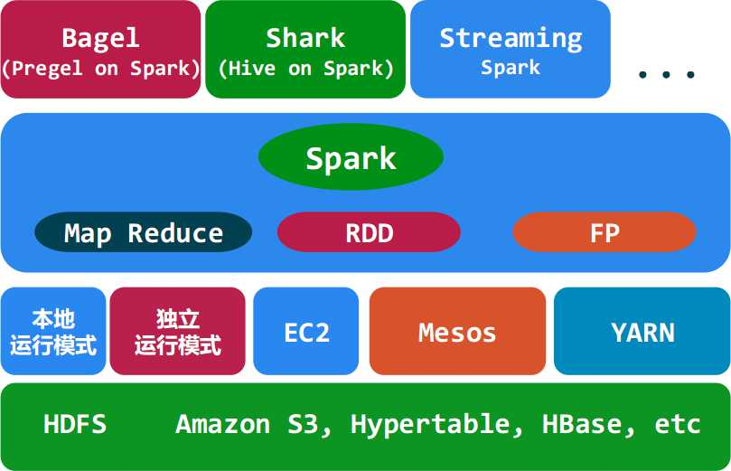
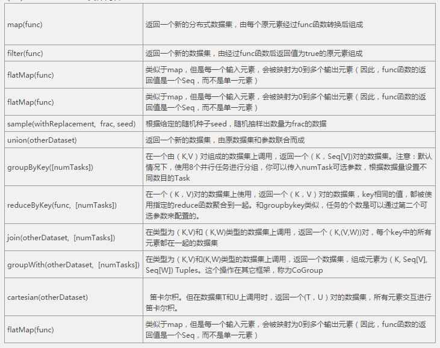
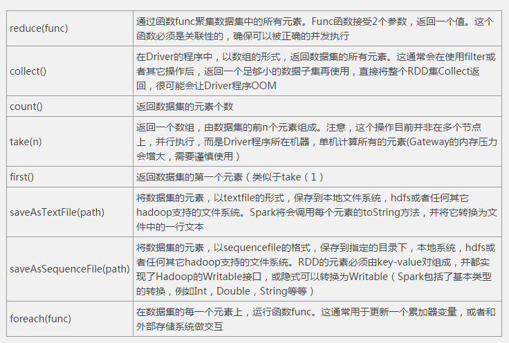

# Spark 使用说明文档

>注：spark现支持scala、python、java等开发语言。其中使用scala最简便。但由于scala的学习成本高，将在后期补充。本次主要使用java来介绍spark的使用。

导读：  
1. spark的原理  
2. spark的核心操作  
3. spark的简单实例  
4. spark在kerberos安全模式下使用实例
 


## 一、spark的原理    
### 1.1 spark定义  

Spark是UC Berkeley AMP lab所开源的类Hadoop MapReduce的通用的并行计算框架，Spark基于map reduce算法实现的分布式计算，拥有Hadoop MapReduce所具有的优点；但不同于MapReduce的是Job中间输出和结果可以保存在内存中，从而不再需要读写HDFS，因此Spark能更好地适用于数据挖掘与机器学习等需要迭代的map reduce的算法。其架构如下图所示： 
 


### 1.2 spark特点   


-   高可伸缩性  
-   容错性  
-   可用性强 
-   基于内存计算，速度快   


### 1.3 spark的核心概念————RDD  
RDD(Resilient Distributed Dataset : 弹性分布数据集)是Spark的最基本抽象,是对分布式内存的抽象使用，实现了以操作本地集合的方式来操作分布式数据集的抽象实现。RDD是Spark最核心的东西，它表示已被分区，不可变的并能够被并行操作的数据集合，不同的数据集格式对应不同的RDD实现。RDD必须是可序列化的。RDD可以cache到内存中，每次对RDD数据集的操作之后的结果，都可以存放到内存中，下一个操作可以直接从内存中输入，省去了MapReduce大量的磁盘IO操作。这对于迭代运算比较常见的机器学习算法, 交互式数据挖掘来说，效率提升比较大。  

**RDD的特点**  

-   它是在集群节点上的不可变的、已分区的集合对象。  
-   通过并行转换的方式来创建如（map, filter, join, etc）。  
-   失败自动重建。  
-   可以控制存储级别（内存、磁盘等）来进行重用。  
-   必须是可序列化的。  
-   是静态类型的。

**RDD的优点**  

-   RDD只能从持久存储或通过Transformations操作产生，相比于分布式共享内存（DSM）可以更高效实现容错，对于丢失部分数据分区只需根据它的lineage就可重新计算出来，而不需要做特定的Checkpoint。  
-   RDD的不变性，可以实现类Hadoop MapReduce的推测式执行。  
-   RDD的数据分区特性，可以通过数据的本地性来提高性能，这与Hadoop MapReduce是一样的。  
-   RDD都是可序列化的，在内存不足时可自动降级为磁盘存储，把RDD存储于磁盘上，这时性能会有大的下降但不会差于现在的MapReduce。


  
## 二、spark的核心操作   

对spark的核心操作也即是对RDD的转换和操作；具体介绍：


1. 对于RDD可以有两种计算方式：转换（返回值还是一个RDD）与操作（返回值不是一个RDD）。  
2. 转换(Transformations) (如：map, filter, groupBy, join等)，Transformations操作是Lazy的，也就是说从一个RDD转换生成另一个RDD的操作不是马上执行，Spark在遇到Transformations操作时只会记录需要这样的操作，并不会去执行，需要等到有Actions操作的时候才会真正启动计算过程进行计算。  
3. 操作(Actions) (如：count, collect, save等)，Actions操作会返回结果或把RDD数据写到存储系统中。Actions是触发Spark启动计算的动因。

详细内容：  

Transformations操作具体内容：  

  

Action 操作具体内容：




## 三、spark的简单实例(Java)   

### 3.1 spark的依赖  
创建maven项目前要先引入如下的依赖： 

    <repositories>
        <repository>
            <id>nodpi</id>
            <name>nodpi Releases</name>
            <url>http://nexus.odpi.org:8081/nexus/content/groups/public</url>
            <layout>default</layout>
        </repository>
        <repository>
			<!--此处引入的是hortonworks提供的第三方私有源-->
            <id>HDPReleases</id>
            <name>HDP Releases</name>
            <url>http://repo.hortonworks.com/content/repositories/releases/</url>
            <layout>default</layout>
        </repository>
    </repositories>
    <!--具体依赖-->
    <dependencies>
        <!--hdfs-->
        <dependency>
            <groupId>org.apache.hadoop</groupId>
            <artifactId>hadoop-client</artifactId>
            <version>2.7.1.2.3.2.0-2950</version>
        </dependency>
        <!--yarn-->
        <dependency>
            <groupId>org.apache.hadoop</groupId>
            <artifactId>hadoop-yarn-client</artifactId>
            <version>2.7.1.2.3.2.0-2950</version>
        </dependency>
       
        <!--spark-->
        <dependency>
            <groupId>org.apache.spark</groupId>
            <artifactId>spark-core_2.10</artifactId>
            <version>1.4.1.2.3.2.0-2950</version>
        </dependency>
        <dependency>
            <groupId>org.apache.spark</groupId>
            <artifactId>spark-yarn_2.10</artifactId>
            <version>1.4.1.2.3.2.0-2950</version>
        </dependency>
		<dependency>
            <groupId>org.apache.spark</groupId>
            <artifactId>spark-sql_2.10</artifactId>
            <version>1.4.1.2.3.2.0-2950</version>
        </dependency>
    </dependencies>
	<!--编译配置-->
    <build>
        <plugins>
            <plugin>
                <artifactId>maven-compiler-plugin</artifactId>
                <version>3.1</version>
                <configuration>
                    <source>1.8</source>
                    <target>1.8</target>
                </configuration>
            </plugin>
        </plugins>
    </build>

>注：此处的spark的版本号指的是对应集群中安装spark的版本；当前使用的是：1.4.1.2.3.2.0-2950

### 3.2 部分api说明 
>注：api 主要是对RDD 的封装和操作；详细请看：
>[https://spark.apache.org/docs/latest/api/java/index.html](https://spark.apache.org/docs/latest/api/java/index.html "spark java api ")

### 3.3 编写过程及代码示例

 
spark的编程即是将spark的核心操作用于相应RDD上最终得到相应结果的过程。一般的编写流程为： 

1. 实例化sparkConf 对象：用于加载spark的相应配置；  
2. 实例化SparkContext对象：SparkContext是Spark的入口，负责连接Spark集群，创建RDD，累积量和广播量等。从本质上来说，SparkContext是Spark的对外接口，负责向调用这提供Spark的各种功能。它的作用是一个容器 。此处我们使用JavaSparkContext类来完成这个操作。
3. 实例化具体类型的Content;（例如：JavaSQLContext、JavaHiveContext、etc)
4. 连接文件或数据做相应操作。

>注：第3步只有在需要具体操作是才需要。一般不用。另在使用相应的content时要考虑相应的依赖和相应的配置文件（配置文件一般放在resources目录中）。  

使用示例：  
```java
	static DataFrame df;
    public static void main(String[] args) {
        SparkConf conf = new SparkConf().setAppName("Spark_Test").setMaster("local[4]");//local[4]测试模式运行
        JavaSparkContext sc = new JavaSparkContext(conf);
        SQLContext sqlContext = new SQLContext(sc);

        JavaPairRDD<Long,BytesWritable> jdcomments = sc.sequenceFile("C://Users//Administrator//Desktop//jd_product.1449053467173",
                Long.class, BytesWritable.class);//加载本地文件

        //JavaPairRDD<Long,BytesWritable> jdcomments = sc.sequenceFile("hdfs://cluster-09:8020/crawler-goods/2015-10-13-goods.1444643071426",Long.class, BytesWritable.class); 
        JavaRDD<String> jdJson = jdcomments.map(new Function<Tuple2<Long, BytesWritable>, String>() {

            @Override
            public String call(Tuple2<Long, BytesWritable> tuple2) throws Exception {
                BytesWritable bytesWritable  = tuple2._2();
                bytesWritable.setCapacity(bytesWritable.getLength());
                String str = new String(bytesWritable.getBytes());
                String str2 = TraversalJson.dealJsonData(str);
                return str2;
            }
        });
        //System.out.println(jdJson.first());
        df = sqlContext.jsonRDD(jdJson);
        //df = sqlContext.createDataFrame(jdJson,BeanData.class);
        //df = sqlContext.
        //df.first().getJavaMap(2);
        df.registerTempTable("comment");
        //

         //System.out.println("df = " +df.first().toString()+"df--"+ df.first().getLong(5));

         DataFrame colors = sqlContext.sql("SELECT * from comment");
        for (String s:colors.columns())
            System.out.println(s);
        //colors.first().toString();
         System.out.println();
		 sc.stop();
```

示例解读：是将一个json文件读取到；经过处理存入表中；在读出部分数据的过程。


更多代码实例：
[https://github.com/apache/spark/tree/master/examples/src/main/java/org/apache/spark/examples](https://github.com/apache/spark/tree/master/examples/src/main/java/org/apache/spark/examples "spark 代码实例")
 

>注：更多参见：[https://spark.apache.org/](https://spark.apache.org/ "spark官网")   


## 四、spark在kerberos安全模式下使用实例  

>注：此处的安全模式是指集群使用了基于kerberos+ranger+knox+ldap的安全策略。

### 4.1 依赖  

版本：此处使用的经过第三方(hortonwork)重构的架包；具体依赖如下： 
	
    <dependencies>
        <!--hdfs-->
        <dependency>
            <groupId>org.apache.hadoop</groupId>
            <artifactId>hadoop-client</artifactId>
            <version>2.7.1.2.3.2.0-2950</version>
        </dependency>
        <!--yarn-->
        <dependency>
            <groupId>org.apache.hadoop</groupId>
            <artifactId>hadoop-yarn-client</artifactId>
            <version>2.7.1.2.3.2.0-2950</version>
        </dependency>
        <!--spark-->
        <dependency>
            <groupId>org.apache.spark</groupId>
            <artifactId>spark-core_2.10</artifactId>
            <version>1.4.1.2.3.2.0-2950</version>
        </dependency>
        <dependency>
            <groupId>org.apache.spark</groupId>
            <artifactId>spark-yarn_2.10</artifactId>
            <version>1.4.1.2.3.2.0-2950</version>
        </dependency>
    </dependencies> 

>注：此处的版本号应该和集群上安装的版本保持一致
	

### 4.2 客户端安全认证 

在此模式下访问spark前需要做安全认证，具体的认证方式如下：  
1. 添加配置文件：主要指先从ambari界面下载spark的配置文件，放入工程项目的resources 目录下，相应的还要添加krb5.conf 和 XX.keytab(相当于kerberos的密钥)放入此目录。  
2. 设置org.apache.hadoop.conf.Configuration 的具体配置，主要是添加步骤1中的keytab文件和其对应的principal（具体看实例）  
3. 安全认证登陆，使用SecurityUtil类的login方法实现。  
4. 开始实例化sparkconf使用访问spark。 

>注：若客户端在windows环境下则在运行前需要 运行 System.setProperty("java.security.krb5.conf"，krb5.conf path);来初始化基础配置。 

### 4.3 示例代码  

```java
    private static final Logger logger = Logger.getLogger(HdfsTest.class);
    private final String KEYTAB_FILE_KEY = "hdfs.keytab.file";
    private final String USER_NAME_KEY = "hdfs.kerberos.principal";
    private Configuration configuration;
    @Override
    public void test() throws Exception {
        System.setProperty("java.security.krb5.conf", "C:\\Users\\Administrator\\Desktop\\test\\src\\main\\resources\\krb5.conf");

        configuration = new Configuration();
        configuration.set(KEYTAB_FILE_KEY, "C:\\Users\\Administrator\\Desktop\\test\\src\\main\\resources\\liweiqi.keytab");//设置keytab文件
        configuration.set(USER_NAME_KEY, "liweiqi@hadoop");//设置keytab文件的principal
        SecurityUtil.login(configuration, KEYTAB_FILE_KEY, USER_NAME_KEY);//安全认证，认证成功后开始连接spark

        SparkConf conf = new SparkConf().setAppName("test security").setMaster("yarn-client");//yarn-client 模式运行
        JavaSparkContext sc = new JavaSparkContext(conf);
        String filePath = "hdfs://hadoop01.domain:8020/liweiqi/install.log";
        JavaRDD<String> rdd = sc.textFile(filePath);
        long count = rdd.count();
        logger.info(count);
    }

    public static void main(String[] args) throws Exception {
        new SparkTest().test();
    }
```  

 
